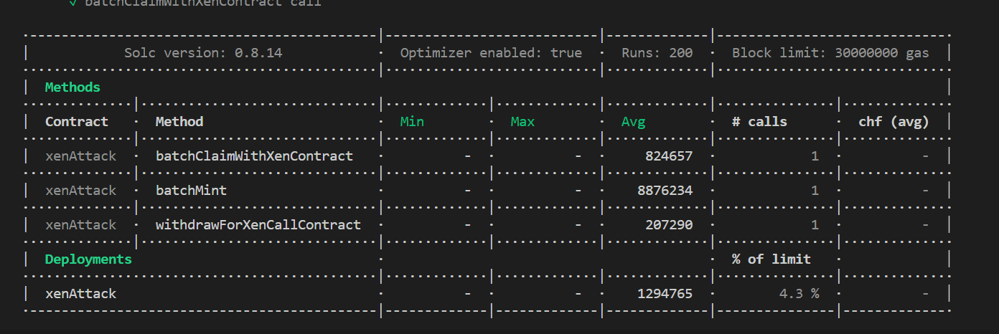
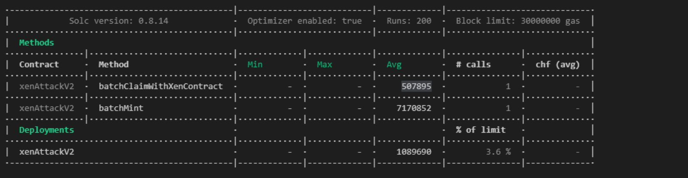
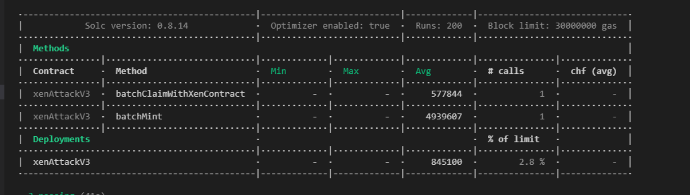
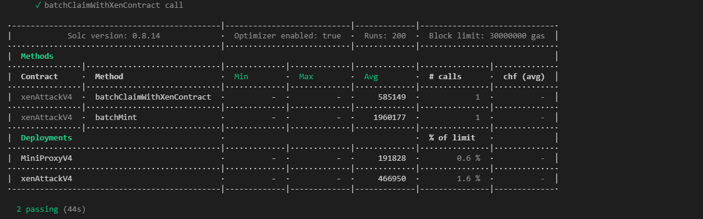

# Sample Hardhat Project

This project demonstrates a basic Hardhat use case. It comes with a sample contract, a test for that contract, and a script that deploys that contract.

Try running some of the following tasks:

deploy for bsc : https://bscscan.com/address/0x0fb53e6c005d050dc853ee9fccbe686741f8bad6#writeContract
owner address :0xcf3285e093cd93015e7456911e2db34AB4975bAd

### 测试gas报告
https://github.com/cgewecke/hardhat-gas-reporter

根据gas报告分析gas优化程度，单次mint 优化到 18471591 Gwei

### 提供单元测试覆盖率报告
根据报告分析当前TEST 是否全面
https://github.com/sc-forks/solidity-coverage

### gas优化方案
1. 使用assembly create2 创建代理合约 ，使用salt计算创建合约的地址，减少storage消耗(new(slat)也行，但是需要测试增加了多少GAS)
2. 使用immutable 来存储 deploy和user地址变量，防止slot0冲突
3. 使用 encode selector 进行函数调用(不确定 节省多少，需要进行测试)
4. 使用miniProxy代理进行逻辑合约的调用 logic合约部署一份，节省部署gas
5. 逻辑优化，claim时候直接share到指定地址，减少调用步骤

### gas优化记录
**ps:gas测试以批量claim 10个账号进行**

1. 第一次gas：
Deployments   1294765 
batchMint   8876234 
batchClaimWithXenContract 824657 

2. 第二次优化测试gas
Deployments   1089690
batchMint   7170852
batchClaimWithXenContract 507895

优化了(1,2,5)
mint gas 减少了 170W 
期间踩了一个`create2`的坑：`create2` 创建的合约如果构造函数里有传入参数，或者对immutable 进行赋值后，合约的byteCode会改变，用于计算地址的`type(xenCallV2).creationCode)` 是不匹配的
解决方案：将参数 encode进字节码中，例：  `keccak256(abi.encodePacked(type(Pair).creationCode,abi.encode(_factoryAddress)))`

3. 第三次优化测试 
Deployments   845100 
batchMint   4939607 
batchClaimWithXenContract 577844 
修改使用proxy进行create2 并且使用call abi.encodeWithSignature(function)进行XEN调用 

4. 第四次优化测试

Deployments   466950 + 191828
batchMint   1960177
batchClaimWithXenContract 585149
安装gasPrice 2.5Gwei，ETH 1300U 计算， mint 10次总共花费 0.0049004425ETH 约等于 6.3U
相比于mint 10次只需要原本一次的gas费用

使用miniproxy
EIP-1167，又称 Minimal Proxy Contract，提供了一种低成本复制合约的方法。具体介绍: `https://mirror.xyz/xyyme.eth/mmUAYWFLfcHGCEFg8903SweY3Sl-xIACZNDXOJ3twz8`
测试后可以看到 相比于通用的create合约 使用EIP-1167 复制的合约gas将大大减小。

### 压力测试
1. mint 100
batchMint   18989296 
batchClaimWithXenContract 5184060 

1. mint 150 
batchMint   28450011 
batchClaimWithXenContract 7740348 

从以太坊区块浏览器上可以知道目前区块最大gaslimit 3000W 

使用我们最大打包的交易次数为157次。

